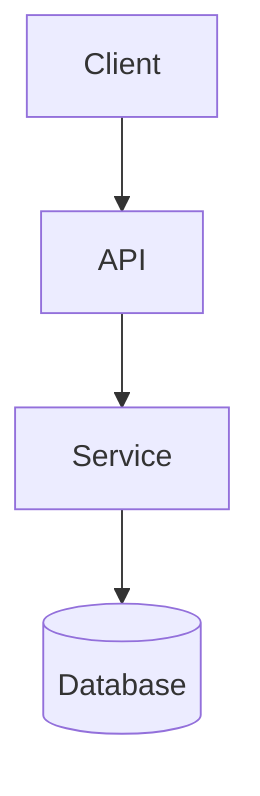

# ARCHITECTURE — System Structure

> **Purpose:** Describe how the system is put together so the agent can place changes correctly and reason about coupling and failure. Tier-3 template — fill it in. Add a Mermaid diagram only once the structure is genuinely clear; do not invent one.

_Last updated: [DATE]_

## Top-Level Overview

[PLACEHOLDER: What the system is, its major runtime pieces, and how a request/data flows through at a high level.]

## Design Methodology & Patterns

[PLACEHOLDER: Architectural style (layered, hexagonal, event-driven, etc.) and the key patterns the codebase commits to.]

## Component Map

[PLACEHOLDER: The main components/modules and each one's responsibility.]

<!-- Add a Mermaid diagram only when the structure is verified and clear:

-->

## Data Flow

[PLACEHOLDER: How data moves between components for the primary use cases.]

## Integration Points & Failure Modes

[PLACEHOLDER: External systems integrated with, and how each failure is handled (timeout, retry, fallback, dead-letter).]

## Scaling Limits

[PLACEHOLDER: Known bottlenecks and the expected load ceiling — state limits explicitly rather than claiming it "scales".]
```
