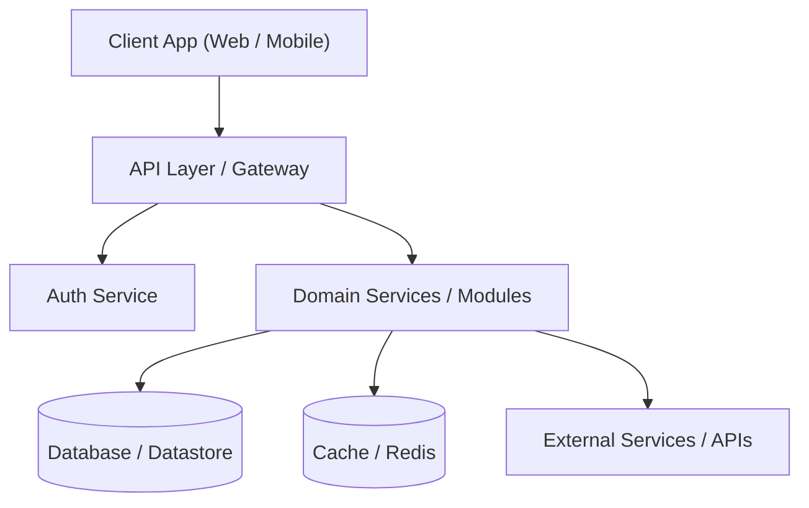
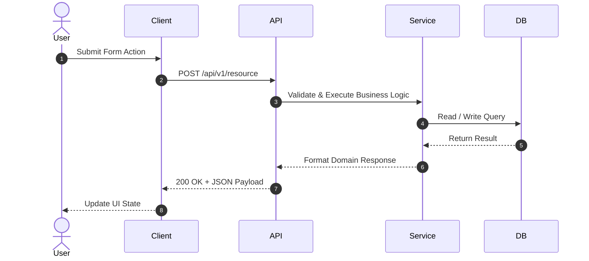

# ARCHITECTURE — System Architecture

> **Purpose:** Describe the high-level architecture, module boundaries, data flows, client/server structure, and cross-cutting concerns so developer decisions align with system integrity. Tier-3 template — fill it in for your project.

_Last updated: [DATE]_

---

## 1. System Overview & High-Level Architecture

[PLACEHOLDER: Provide a high-level summary of the system topology, key services, entry points, and primary communication protocols.]

### Architecture Diagram



---

## 2. Layered Architecture & Conventions

[PLACEHOLDER: Detail the internal layered design pattern (e.g. Hexagonal, Clean Architecture, Layered MVC).]

- **Presentation / View Layer:** UI components, page routes, controller handlers.
- **Application / Domain Layer:** Business logic, domain entities, use cases, workflow orchestration.
- **Infrastructure / Data Access Layer:** ORM repositories, database clients, third-party API adapters.

---

## 3. Directory & Domain Structure

[PLACEHOLDER: Detail directory organization and strict module boundary rules.]

```
src/
├── components/      # Shared reusable UI primitives
├── features/        # Feature modules grouped by domain
│   ├── auth/        # Feature domain (components, hooks, services)
│   └── dashboard/   # Feature domain
├── lib/             # Third-party configuration & SDK wrappers
├── services/        # API and data fetching clients
└── types/           # Shared domain TypeScript types
```

---

## 4. Middleware & Request Pipeline

[PLACEHOLDER: Detail the HTTP request/response pipeline and middleware execution order.]

- **Step 1:** CORS & Rate Limiting Middleware
- **Step 2:** Authentication & Token Validation Middleware
- **Step 3:** Request Validation Middleware (Zod / Schema check)
- **Step 4:** Route Handler / Controller Execution
- **Step 5:** Global Error & Response Formatting Middleware

---

## 5. Client-Side Architecture

[PLACEHOLDER: Detail front-end state management, view hierarchy, and routing strategy.]

- **View Layer:** React / React Native / Vue components.
- **State Management:** Local component state, Server state (React Query / SWR), Global client state (Zustand / Redux Toolkit).
- **Routing Strategy:** File-system routing (Next.js / Expo Router) or declarative router (React Router).

---

## 6. Data Layer & Database Strategy

[PLACEHOLDER: Detail data persistence methods, ORM selection, connection pooling, and caching strategy.]

- **ORM / Query Builder:** Prisma / Drizzle / TypeORM / Kysely.
- **Caching Layer:** Redis / In-Memory cache for read-heavy operations.
- **Connection Management:** Connection pooling, read-replicas, and transaction management rules.

---

## 7. Authentication & Authorization Flow

[PLACEHOLDER: Describe the authentication mechanism and permission enforcement model.]

- **Auth Provider:** OAuth 2.0 / OIDC / Supabase Auth / NextAuth / Clerk.
- **Session Model:** JWT Bearer Tokens in HTTP-only cookies or SecureStore.
- **Authorization Model:** Role-Based Access Control (RBAC) or Attribute-Based Access Control (ABAC).

---

## 8. Key Data Flows & Sequence Diagrams

[PLACEHOLDER: Map out primary end-to-end data flows with sequence diagrams.]



---

## 9. Domain Logic Highlights

[PLACEHOLDER: Explain non-obvious business rules, state machines, or complex calculations in the domain.]

- **Domain Calculation X:** Rules governing pricing, discounts, or metric aggregation.
- **State Machine Y:** Valid state transitions for orders, workflows, or entity lifecycles.

---

## 10. Cross-Cutting Concerns

[PLACEHOLDER: Specify standards for error handling, validation, security, and performance.]

- **Error Handling:** Standardized error payloads (`code`, `message`, `details`), error boundaries.
- **Input Validation:** Zero-trust schema validation at trust boundaries (API parameters, forms).
- **Security:** CSRF protection, Content Security Policy (CSP), parameterized SQL queries, secret management.
- **Observability & Logging:** Structured JSON logging (Pino / Winston), error monitoring (Sentry), APM tracing.
- **Performance Budgets:** Bundle size limits, API response latency targets.
