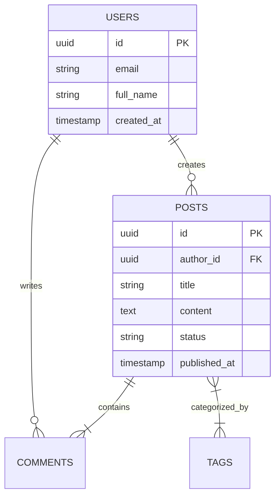

# SCHEMA — Database & API Schema

> **Purpose:** Document the database structure, table definitions, relationships, security policies, and API contracts so developers and AI agents query and manipulate data safely without guessing schema details. Tier-3 template — fill it in for your project.

_Last updated: [DATE]_

---

## 1. Data Layer Overview

[PLACEHOLDER: Overview of the primary datastores (Relational, Document, Key-Value, Vector) and their responsibilities.]

- **Primary Database:** PostgreSQL / MySQL / SQLite / Supabase
- **Cache Datastore:** Redis / In-Memory
- **Object Storage:** AWS S3 / Cloudflare R2 / Supabase Storage

---

## 2. Database Tables & ER Diagram

[PLACEHOLDER: Provide a visual Entity-Relationship (ER) diagram of database entities.]



---

## 3. Table Schemas & Column Definitions

[PLACEHOLDER: Document exact table structures, data types, constraints, and indexes.]

### Table: `users`

| Column Name  | Data Type      | Nullable | Default             | Constraints / Index | Description               |
| :----------- | :------------- | :------- | :------------------ | :------------------ | :------------------------ |
| `id`         | `UUID`         | No       | `gen_random_uuid()` | Primary Key         | Unique user identifier    |
| `email`      | `VARCHAR(255)` | No       | None                | Unique Index        | User login email          |
| `role`       | `VARCHAR(50)`  | No       | `'member'`          | Check constraint    | User authorization role   |
| `created_at` | `TIMESTAMPTZ`  | No       | `NOW()`             | None                | Record creation timestamp |

### Table: `posts`

| Column Name | Data Type      | Nullable | Default             | Constraints / Index          | Description            |
| :---------- | :------------- | :------- | :------------------ | :--------------------------- | :--------------------- |
| `id`        | `UUID`         | No       | `gen_random_uuid()` | Primary Key                  | Unique post identifier |
| `author_id` | `UUID`         | No       | None                | Foreign Key (`users.id`)     | Reference to author    |
| `title`     | `VARCHAR(255)` | No       | None                | Index                        | Post title             |
| `status`    | `VARCHAR(20)`  | No       | `'draft'`           | Check (`draft`, `published`) | Publication state      |

---

## 4. Row-Level Security (RLS) & Access Policies

[PLACEHOLDER: Document security boundaries and database access rules.]

- **Table `users`:**
  - `SELECT`: Public profile fields readable by authenticated users.
  - `UPDATE`: Allowed only if `auth.uid() == users.id`.
- **Table `posts`:**
  - `SELECT`: Publicly readable if `status == 'published'`. Authors can read all their own posts.
  - `INSERT / UPDATE / DELETE`: Allowed only if `auth.uid() == posts.author_id`.

---

## 5. API Routes by Domain

[PLACEHOLDER: Categorize REST / GraphQL / RPC routes by domain area.]

### Domain: Auth & Users

- `POST /api/v1/auth/signup` — Register new user account.
- `POST /api/v1/auth/login` — Authenticate and return session token.
- `GET /api/v1/users/me` — Retrieve current authenticated user profile.

### Domain: Posts & Content

- `GET /api/v1/posts` — List published posts (supports pagination & filtering).
- `POST /api/v1/posts` — Create a new post draft.
- `GET /api/v1/posts/:id` — Retrieve post details by ID.
- `PATCH /api/v1/posts/:id` — Update post content or status.

---

## 6. Request & Response Payload Examples

[PLACEHOLDER: Provide concrete JSON examples for API contracts.]

### Request: `POST /api/v1/posts`

```json
{
  "title": "Getting Started with TypeScript",
  "content": "TypeScript adds static typing to JavaScript...",
  "tags": ["typescript", "javascript", "guide"]
}
```

### Success Response: `201 Created`

```json
{
  "success": true,
  "data": {
    "id": "123e4567-e89b-12d3-a456-426614174000",
    "title": "Getting Started with TypeScript",
    "status": "draft",
    "created_at": "2026-07-22T00:00:00Z"
  }
}
```

### Error Response: `400 Bad Request`

```json
{
  "success": false,
  "error": {
    "code": "INVALID_INPUT",
    "message": "Validation failed",
    "details": [
      { "field": "title", "issue": "Title must be at least 3 characters long" }
    ]
  }
}
```

---

## 7. Phase-Based Route Priority

[PLACEHOLDER: Specify route implementation priority across delivery phases.]

- **Phase 1 (MVP):** Essential Auth endpoints (`signup`, `login`), Core CRUD routes (`GET/POST posts`).
- **Phase 2 (Enhancement):** Tagging & Search APIs, User Profile management.
- **Phase 3 (Scale):** Bulk export routes, Webhooks, Admin analytics endpoints.

---

## 8. Migrations & Schema Versioning

[PLACEHOLDER: Explain schema migration procedures.]

- **Migration Tooling:** Prisma Migrate / Drizzle Kit / Supabase Migrations.
- **File Naming Convention:** `YYYYMMDDHHMMSS_description.sql`.
- **Execution Strategy:** Zero-downtime additive migrations (add columns/tables first, deprecate old columns in subsequent releases).
