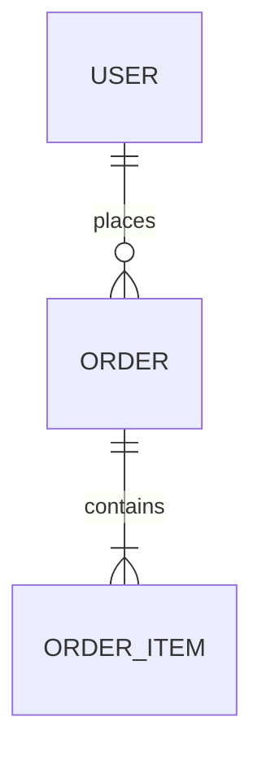

# SCHEMA — Data Model

> **Purpose:** Describe the data layer so the agent doesn't guess table/model shapes or relationships. Tier-3 template — fill it in. **If the project has no data layer, say so here and keep the rest short.**

_Last updated: [DATE]_

## Data Layer

[PLACEHOLDER: The datastore(s) in use (e.g. Postgres, DynamoDB, none). If there is no persistent data layer, state that and stop here.]

## Tables / Collections / Models

[PLACEHOLDER: Each entity, its key fields and types, and its purpose.]

## Relationships

[PLACEHOLDER: How entities relate. Add a Mermaid `erDiagram` only when the relationships are verified:]

<!--

-->

## Access / RLS Policies

[PLACEHOLDER: Row-level security, access rules, or authorization boundaries at the data layer.]

## Migrations

[PLACEHOLDER: How schema changes are managed — migration tool, naming, and the reversibility expectation.]
