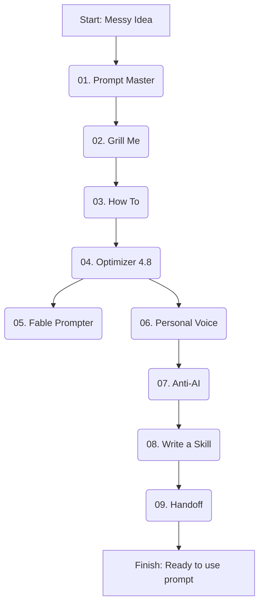

# 9-Step Prompt Engineering Workflow

Turn messy ideas into clear, powerful prompts with these 9 Claude Skills.

From asking the right questions to improving structure, matching your voice, removing obvious AI patterns, and creating reusable skills—this workflow helps you build prompts that are clearer, more useful, and easier to reuse.

## The Pipeline

## The 9 Skills

1. **[01. Prompt Master](01-prompt-master.md):** Brain dump in, clean task spec out.
2. **[02. Grill Me](02-grill-me.md):** Asks questions until nothing is vague.
3. **[03. How To](03-how-to.md):** Maps the steps you don't know yet.
4. **[04. Optimizer 4.8](04-optimizer-4-8.md):** Polishes your prompt for Opus 4.8.
5. **[05. Fable Prompter](05-fable-prompter.md):** Same polish, but for Fable 5.
6. **[06. Personal Voice](06-personal-voice.md):** Tunes it to sound like you.
7. **[07. Anti-AI](07-anti-ai.md):** Strips the AI tells from the draft.
8. **[08. Write a Skill](08-write-a-skill.md):** Bottles it as a reusable skill.
9. **[09. Handoff](09-handoff.md):** Creates a handoff doc to start your next chat.

The real advantage is not just writing one better prompt. It is building a repeatable system that turns ideas into consistent results.
